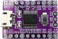
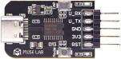

# CH32V003

Official Resources

* [Product Page](http://www.wch-ic.com/products/CH32V003.html)
* [Datasheet (CH32V003DS0.pdf)](http://www.wch-ic.com/downloads/CH32V003DS0_PDF.html)
* [Reference Manual (CH32V003RM.pdf)](http://www.wch-ic.com/downloads/CH32V003RM_PDF.html)
* [QingKeV2 Processor Manual (.pdf)](http://www.wch-ic.com/downloads/QingKeV2_Processor_Manual_PDF.html)
* [GitHub repository](https://github.com/openwch/ch32v003)

## Community Highlight

https://github.com/cnlohr/ch32v003fun

## Development Boards

### CH34V003A4M6 Development Board by wagiminator

https://github.com/wagiminator/Development-Boards/tree/main/CH32V003A4M6_DevBoard

### CH32V003F4P6 Development Board by wagiminator

https://github.com/wagiminator/Development-Boards/tree/main/CH32V003F4P6_DevBoard

### nanoCH32V003 by MuseLab

https://github.com/wuxx/nanoCH32V003

https://www.tindie.com/products/johnnywu/nanoch32v003-development-board/

https://www.aliexpress.com/item/1005005221751705.html

### CH32V003 Evaluation Board by WCH

CH32V03F4P6-R0-1v1

https://wchofficialstore.aliexpress.com/

### CH32V003 Development Board by Maker go

https://www.tindie.com/products/adz1122/ch32v003-risc-v-mcu-development-board/

## Programmers

### WCH-LinkE by WCH

_Note: There are several WCH-Link variants that look very similar, but only WCH-Link**E** and WCH-Link**W** support CH32V003._

* [Product Page](http://www.wch-ic.com/products/WCH-Link.html)
* [Schematic (WCH-LinkSCH.pdf)](https://www.wch.cn/downloads/WCH-LinkSCH_PDF.html)
* [WCH-LinkUtility](https://www.wch.cn/downloads/WCH-LinkUtility_ZIP.html)

Extra Features
* Automatic firmware upgrade (CH32V305F),
* USB serial port (`printf()` output redirect)
* Software controllable 3.3V and 5V power supply pins (max 200 mA and 400 mA respectively).

### WCH-LinkE by Maker go

https://www.tindie.com/products/adz1122/wch-linke-online-download-debugger-ch32v003/

### WCH-LinkE by MuseLab

https://www.tindie.com/products/johnnywu/wch-linke-debugger/

### ESP32S2-funprog

https://github.com/cnlohr/esp32s2-cookbook/tree/master/ch32v003programmer
